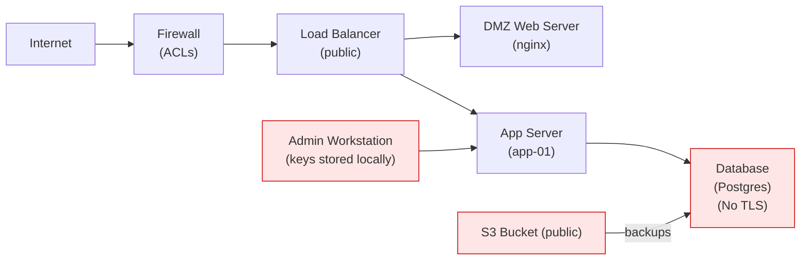

# DevSecOps-Manager
Skills Assessment for Manager of DevOps role
# Manager of DevSecOps Skills Assessment
Duration: 90 minutes

Total Score: 100 points

Question Types: Short Answer, Scenario-based questions, Hands-on Challenges

# Section 1: Leadership & Management (20 points)
### Question 1: (5 points)
Describe your approach  to mentoring technical staff(system admins, CI/CD Engineers, cloud engineers, security engineers etc.) How do you measure success?

### Question 2: (5 points)
How would you balance conflicting priorities between teams and processes? Example: Security and speed of delivery in CI/CD Pipeline?

### Question 3: (10 points) (Scenario-based Question)
There is a situation where the CI/CD and Eingeering team wants to push a risky update due to pressure to meet a deadline. Assess their decision-making and stakeholder communication.

# Secution 2: Security Engineering (20 points)
### Question 4: (5 points)
Walk through your respons to a reansomware attack affecting a production database.

### Question 5: (5 points)
What is your approach to balancing security best practices with developer productivity?

### Question 6: (10 points) (Hands-on Challenge)
Below is a log snippet showing suspicious activity. Identify possible indicators of compromise and outline an incident response plan.

```text
Jan 21 02:14:32 webserver1 sshd[2031]: Failed password for invalid user admin from 192.168.15.45 port 50214 ssh2
Jan 21 02:14:34 webserver1 sshd[2031]: Failed password for invalid user admin from 192.168.15.45 port 50214 ssh2
Jan 21 02:14:36 webserver1 sshd[2031]: Accepted password for testuser from 192.168.15.45 port 50220 ssh2
Jan 21 02:14:37 webserver1 sshd[2031]: testuser : TTY=pts/1 ; PWD=/home/testuser ; USER=root ; COMMAND=/bin/su
Jan 21 02:14:39 webserver1 su[2078]: pam_unix(su-l:session): session opened for user root by testuser(uid=1002)

Jan 21 02:17:11 webserver1 sudo[2084]: testuser : TTY=pts/1 ; PWD=/home/testuser ; USER=root ; COMMAND=/bin/bash
Jan 21 02:17:15 webserver1 kernel: IPTables-Dropped: IN=eth0 OUT= MAC=00:50:56:b2:12:34:00:0c:29:ab:cd:ef:08:00 SRC=192.168.15.45 DST=10.0.0.5 LEN=52 TOS=0x00 PREC=0x00 TTL=111 ID=54321 DF PROTO=TCP SPT=52411 DPT=3306 WINDOW=8192 RES=0x00 SYN URGP=0

Jan 21 02:18:45 webserver1 apache2[2150]: 192.168.15.45 - - [21/Jan/2025:02:18:45 +0000] "GET /wp-admin/install.php HTTP/1.1" 404 502 "-" "Mozilla/5.0 (compatible; sqlmap/1.5.2#stable)"
Jan 21 02:18:46 webserver1 apache2[2150]: 192.168.15.45 - - [21/Jan/2025:02:18:46 +0000] "GET /index.php?id=1' OR '1'='1 HTTP/1.1" 200 1542 "-" "sqlmap/1.5.2#stable"
```

# Section 3: Systems & Infrastructure (20 points)
### Question 7: (5 points)
Explain how you use Infrastructure-as-code (e.g., Terraform, Ansible) to improve system reliability.

### Question 8: (5 points)
Describe how you would troubleshoot performance degradation in a production environment.

### Question 9: (10 points) (Hands-on challenge)
Below is a diagram of a server/network environment with misconfigurations. Please identify risks and propose fixes.


# Section 4: Cloud Engineering & CI/CD (20 points)
### Question 10: (5 points)
Please explain what a network microsegmentation is and how it applies to a cloud environment.

### Question 11: (5 points)
How do you ensure CI/CD pipelines are both secure and scalable?

### Question 12: (10 points) (Scenario-based Question)
We are being asked to migrate a critical business application to AWS. The application consists of:
- A web front-end hosted in containers (ECS).

- A backend API running on EC2 instances.

- A PostgreSQL database in RDS.

- CI/CD pipelines in Github that deploy code changes daily.

Recently, leadership noticed delays in feature releases and increased downtime during deployments. Additionally, security flagged that sensitive environment variables were stored in plaintext in the pipeline configuration.

You, as the new DevSecOps Manager, are asked to lead a review and redesign of the cloud deployment and CI/CD practices.

# Section 5: Database Administration (20 points)
### Question 13: (5 points)
Explain how you would deploy Role Based Access for a production database that all R&D team members can access.

### Question 14: (5 points)
What’s the difference in how you monitor performance for SQL (PostgreSQL/MySQL) vs. NoSQL (MongoDB)?

### Question 15: (10 points) (Scenario-based Question)
You are the DevSecOps Manager overseeing a PostgreSQL database that supports a SaaS application. The application has different types of users:

- App Developers → Need read/write access to application tables (but no admin privileges).

- Data Analysts → Need read-only access to reporting tables.

- DB Admins → Full control of the database.

Security has flagged that currently all developers are using the same postgres superuser account to access the database — a serious violation of access control best practices.

Your task is to design and implement a role-based access model that resolves this.


